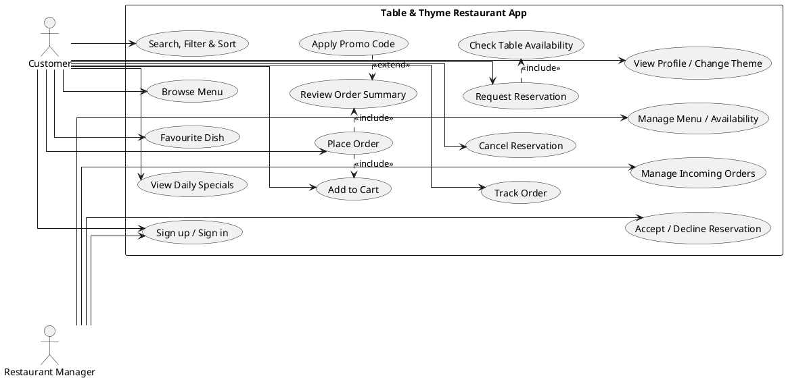
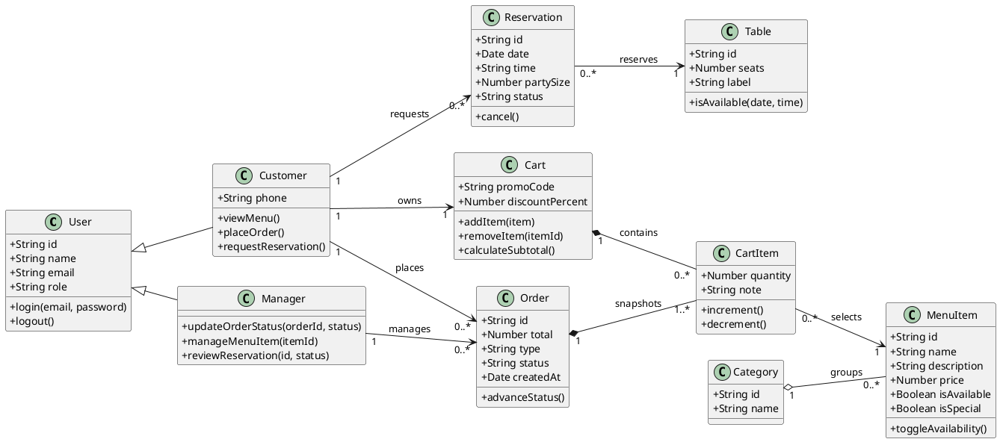
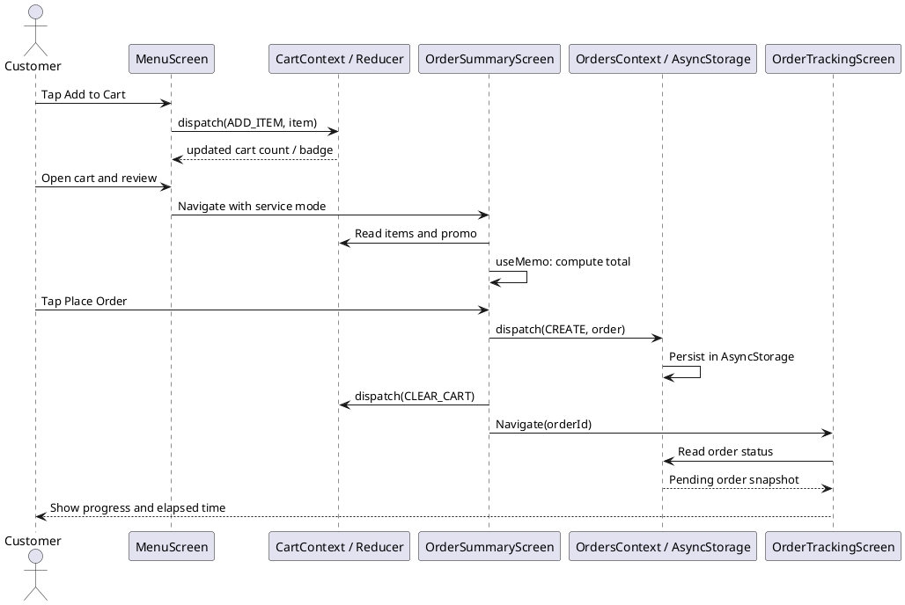
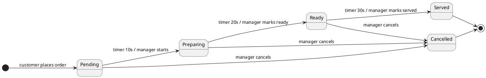
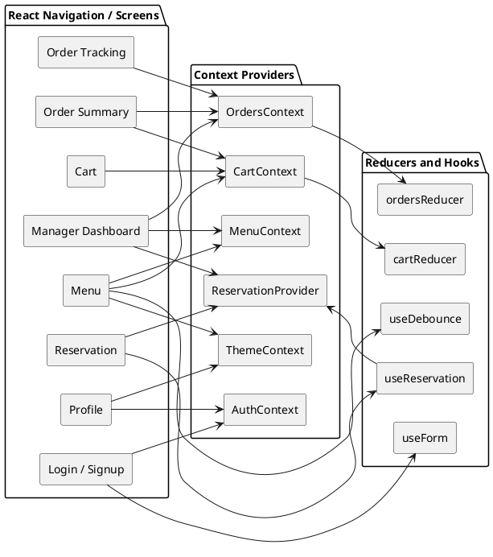

# Software Requirements Specification — Table & Thyme Restaurant App MVP

**Course:** Mobile Application Development (MAD)
**Assignment:** A1 — Restaurant App MVP, Fall 2026
**Version:** 1.0 (frontend-only prototype)
**Date:** 28 September 2026

## Customer Discovery

The following requirements are based on the expected needs of a customer using a restaurant application. The focus is on making the menu easy to browse, reducing the time needed to find dishes, providing clear reservation information, and making the ordering process straightforward.

| Requirement area            | User need                                                                                                                                              |
| --------------------------- | ------------------------------------------------------------------------------------------------------------------------------------------------------ |
| Menu browsing               | A customer should be able to see current dishes, prices, descriptions, availability, and daily specials.                                               |
| Search and filtering        | A customer should be able to search for dishes and filter them by category to find items quickly.                                                      |
| Ordering                    | A customer should be able to add dishes to a cart, change quantities, add notes, and review the total before placing an order.                         |
| Reservations                | A customer should be able to select a date, party size, and available time slot before submitting a reservation request.                               |
| Order tracking              | A customer should be able to view an order summary and follow its progress through the available order stages.                                         |
| Accessibility and usability | The application should use readable text, clear controls, appropriate touch targets, and a theme that remains usable in different lighting conditions. |
| Returning customers         | Customers should be able to use favourites and recent searches to make repeated browsing easier.                                                       |
| Manager operations          | A restaurant manager should be able to view orders and reservations and make basic menu and status changes.                                            |

These requirements form the basis for the customer stories and functional requirements described below. The application is a classroom MVP using local mock data and does not represent a production restaurant system.

## 1. Introduction

### 1.1 Purpose

This SRS specifies the behavior and client-side architecture of the Table & Thyme Restaurant App MVP, version 1.0. It is intended for the student developer, course evaluator, and a restaurant stakeholder reviewing the prototype. It defines the requirements implemented in the React Native frontend and the boundaries of simulated data and behavior.

### 1.2 Scope

**In scope:**

* Sign-in against two local demo accounts and an in-session signup form with Customer or Manager role.
* Browse 16 mock dishes across Starters, Mains, Desserts, and Drinks; see price, description, daily-special badge, and availability.
* Search after a 400 ms debounce, category filtering, recent-search suggestions, sorting, favourites, pull-to-refresh, and back-to-top control.
* Add dishes, change quantities, remove items, enter item notes, and apply the local WELCOME10 or FEAST20 promo code.
* Review a fee/discount breakdown and place a mock dine-in or takeaway order.
* View order history and a demo lifecycle that advances Pending → Preparing → Ready → Served; a manager may set a status manually.
* Request a mock table reservation with date, hourly slot, party size, Pakistani mobile validation, confirmation, cancellation, and manager accept/decline controls.
* View a profile, toggle the global light/dark theme, and see a Manager tab only for a manager account.
* Edit menu prices/availability or add menu items as a manager; persist menu edits, orders, and reservations in device-local AsyncStorage.

**Out of scope:** real authentication, remote APIs or database, payments/refunds, push notifications, production identity/security, real-time multi-device synchronization, restaurant POS integration, inventory deduction, delivery dispatch, geolocation, and actual reservation confirmation by restaurant staff. All money and lifecycle behavior are demonstrations only.

### 1.3 Definitions and acronyms

| Term         | Definition                                                                                                            |
| ------------ | --------------------------------------------------------------------------------------------------------------------- |
| SRS          | Software Requirements Specification; a testable description of the system.                                            |
| MVP          | Minimum Viable Product; the smallest prototype demonstrating the core user journey.                                   |
| UML          | Unified Modeling Language; a notation for structural and behavioral system diagrams.                                  |
| Hook         | A React function that gives function components state or lifecycle capabilities.                                      |
| Context      | React mechanism for sharing a value through a component tree without passing it through every intermediate component. |
| Reducer      | A pure function that calculates next state from current state and an action.                                          |
| Mock data    | Local sample data used in place of a production backend.                                                              |
| FlatList     | React Native's virtualized list component for rendering scrolling collections efficiently.                            |
| AsyncStorage | Asynchronous key-value storage on the device; not encrypted or a server database.                                     |
| Debounce     | Delay an action until input has remained unchanged for a specified time.                                              |
| FR / NFR     | Functional Requirement / Non-Functional Requirement.                                                                  |

## 2. Overall Description

### 2.1 User roles

| Role                    | Key permissions and goals                                                                                                                                                                                                                   |
| ----------------------- | ------------------------------------------------------------------------------------------------------------------------------------------------------------------------------------------------------------------------------------------- |
| Customer                | Sign in or create an in-session account; browse/search/sort menu; favourite and add available items; edit a cart and promo; choose takeaway or dine-in; request/cancel reservations; place and track local demo orders; view profile/theme. |
| Restaurant Manager      | All prototype account capabilities plus a manager-only dashboard; view orders and set their status; accept or decline reservations; add menu entries; change displayed prices and availability.                                             |
| Unauthenticated visitor | View the sign-in/signup screen only; no protected tabs are rendered until a local account is selected.                                                                                                                                      |

### 2.2 User stories

1. As a customer, I want to see today's menu and daily specials, so that I can decide what to order before arriving.
2. As a customer, I want to search and filter dishes by category, so that I can find a suitable item quickly.
3. As a customer, I want to see unavailable dishes and prices, so that I do not add an item the kitchen cannot prepare.
4. As a customer, I want to reserve a table for my party at an available hourly slot, so that I can reduce waiting when I arrive.
5. As a customer, I want a clear order summary and progress indicator, so that I understand the estimated total and current preparation stage.
6. As a customer, I want to save an item as a favourite, so that I can find it again on a later visit.
7. As a customer, I want to add special instructions per cart item, so that the kitchen receives a simple preparation preference in the demo order.
8. As a Restaurant Manager, I want to see incoming orders and update their status, so that the prototype demonstrates a kitchen workflow.
9. As a Restaurant Manager, I want to accept or decline reservations, so that requests have a visible outcome.
10. As a Restaurant Manager, I want to add menu items and change prices or availability, so that customers see the same updated local menu.
11. As a customer, I want a light/dark appearance switch, so that I can use the app comfortably in different lighting.

## 3. Functional Requirements

Each statement is intended to be testable against the frontend prototype.

### Authentication

* **FR-01.** The system shall show a login/signup mode switch on the authentication screen.
* **FR-02.** The system shall validate email format and require passwords of at least eight characters containing at least one digit.
* **FR-03.** The system shall require full name, role, and matching password confirmation in signup mode.
* **FR-04.** The system shall clear a field's validation message when that field is edited.
* **FR-05.** The system shall wait one second, show a spinner, and disable the submit action while checking local demo credentials.
* **FR-06.** The system shall store the selected demo user in AuthContext and expose logout; the manager tab shall be visible only when the role is manager.

### Menu and Search

* **FR-07.** The system shall show at least 15 menu records spanning Starters, Mains, Desserts, and Drinks.
* **FR-08.** The system shall show a loading state for 1.5 seconds on menu entry and allow retry if loading fails.
* **FR-09.** The system shall render menu records in a FlatList with stable IDs, descriptions, prices, images, and daily-special badges.
* **FR-10.** The system shall disable the add action and visually mute an unavailable dish.
* **FR-11.** The system shall filter by selected category and case-insensitive search query and sort by featured/default, price ascending, price descending, or name ascending.
* **FR-12.** The system shall apply search text after 400 ms of inactivity, expose the latest five unique search terms, and avoid inserting duplicate consecutive terms.
* **FR-13.** The system shall focus the search field from its icon, clear it without losing focus, show an empty state, and display a back-to-top action after 300 px of list scrolling.
* **FR-14.** The system shall support pull-to-refresh and update the menu header with the visible-item count.

### Cart and Order Summary

* **FR-15.** The system shall add an available menu item and increment its quantity on repeated additions.
* **FR-16.** The system shall increment, decrement, remove an item, update its note, and clear the cart without mutating prior reducer state.
* **FR-17.** The system shall show a live total-quantity badge on the Cart tab.
* **FR-18.** The system shall accept WELCOME10 for 10% or FEAST20 for 20% off and display an error for any other code.
* **FR-19.** The system shall allow a customer to select Takeaway or Dine-in and enter the related pickup time or table label.
* **FR-20.** The system shall calculate subtotal, 5% service charge, 15% sales tax, promo discount, and grand total in the order summary.
* **FR-21.** The system shall create a local Pending order containing ID, items, total, type, timestamp, and order context, then clear the cart and navigate to tracking.

### Reservation

* **FR-22.** The system shall offer hourly reservation slots from 12:00 through 22:00.
* **FR-23.** The system shall disable a slot when no unreserved mock table can accommodate the requested party size.
* **FR-24.** The system shall validate Pakistani mobile numbers before allowing a reservation request.
* **FR-25.** The system shall create a reservation with customer, date, time, party size, contact information, table, and status information and show a confirmation.
* **FR-26.** The system shall allow a customer to view and cancel their local reservations and shall allow a manager to accept or decline reservation requests.

### Orders and Persistence

* **FR-27.** The system shall display the customer's local order history and allow a selected order to be opened in the tracking view.
* **FR-28.** The system shall advance demo order status after 10, 20, and 30 seconds and clear all timers when the tracking screen unmounts.
* **FR-29.** The system shall persist orders, reservations, and manager menu edits in AsyncStorage and show a loading view until hydration completes.

### Manager Dashboard and Theme

* **FR-30.** The system shall restrict the manager dashboard tab to the Manager role.
* **FR-31.** The system shall allow the manager to change order status, accept/decline reservations, add menu items, change displayed price, and toggle availability.
* **FR-32.** The system shall reflect local menu changes on the customer menu immediately through shared state.
* **FR-33.** The system shall show the user's profile details and apply light/dark theme palette changes throughout the app.

## 4. Non-Functional Requirements

* **Usability:** Primary tap targets shall be at least 40 dp high where practical; forms provide labels and adjacent validation feedback; empty, loading, and unavailable states use explanatory text.
* **Performance:** On a typical current device, the local menu should settle into its ready state after the intentional 1.5 s demo delay; FlatList should virtualize results and search should wait 400 ms rather than filter on every keystroke. Performance claims require device measurement before production use.
* **Responsiveness:** Layout uses flexbox, wrapping chips, and scrollable content; it shall remain usable on narrow phones and larger tablets without horizontal page overflow.
* **Maintainability:** Source is separated into `screens`, `components`, `context`, `reducers`, `hooks`, `data`, `navigation`, and `theme`; cards and common inputs/buttons are reusable; reducer updates are pure.
* **Data handling:** No server is contacted. AsyncStorage persists local demo orders, reservations, and menu edits. Auth, cart, favourites, and recent searches reset when the app process restarts unless explicitly persisted later. AsyncStorage is not secure storage; no real passwords or payment details may be entered.
* **Reliability:** Effects that create timeouts/intervals return cleanup functions; storage and mock-loading failures must not leave an infinite spinner. The local prototype is not a source of truth for actual restaurant operations.
* **Compatibility:** The project targets Expo / React Native with bottom-tab and native-stack navigation and should be run in Expo Go or a compatible emulator after dependencies are installed.

## 5. Client-Side Data Model (Mock Data)

| Data set                   | Fields                                                                                    | Description / storage                                                                                                   |
| -------------------------- | ----------------------------------------------------------------------------------------- | ----------------------------------------------------------------------------------------------------------------------- |
| Users                      | `id`, `name`, `email`, `password` (demo only), `role`                                     | Seeded JS array in `src/data/users.js`; signup is in-session only.                                                      |
| Categories                 | `id` or label                                                                             | Four menu categories plus the All filter; local JS array.                                                               |
| MenuItems                  | `id`, `name`, `description`, `price`, `category`, `image`, `isSpecial`, `isAvailable`     | 16 JS seed records; held in MenuContext and persisted after manager edits.                                              |
| Tables                     | `id`, `seats`, `label`                                                                    | Local capacity inventory used only by availability calculation.                                                         |
| Reservations               | `id`, `ownerId`, `date`, `time`, `partySize`, `contactName`, `phone`, `tableId`, `status` | Local mock reservations; customer sees their own `ownerId` records, while manager views all; persisted in AsyncStorage. |
| Cart / CartItems           | `items[{id,name,price,quantity,note}]`, `promoCode`, `discountPercent`                    | Reducer state in CartContext; session-only.                                                                             |
| Orders                     | `id`, `items`, `total`, `type`, `tableOrTime`, `status`, `createdAt`, `updatedAt`         | OrdersContext reducer with AsyncStorage hydration and persistence.                                                      |
| Favourites / SearchHistory | menu item IDs; up to five query strings                                                   | Screen-local React state; resets when the app is restarted.                                                             |

## 6. UML Diagrams

The corresponding PNG exports are in `A1/UML/`.

### 6.1 Use Case Diagram — `use-case.png`



The diagram distinguishes Customer and Restaurant Manager capabilities. Placing an order includes reviewing the order and may include applying a promo; reservation request includes checking availability. Manager operations are restricted to the manager actor.

### 6.2 Class Diagram — `class-diagram.png`



The structural diagram shows User inheritance into Customer and Manager, menu/category ownership, cart/cart-item composition, and order/reservation/table associations with types, operations, and multiplicities.

### 6.3 Sequence Diagram — `order-sequence.png`



The sequence follows a customer tap on Add to Cart through MenuScreen, CartContext/Reducer, summary calculation, OrdersContext persistence, and the Order Tracking screen.

### 6.4 Order State Machine — `order-state.png`



The diagram defines Pending, Preparing, Ready, Served, and Cancelled states with timer or manager events. Cancelled is terminal in the prototype; actual restaurant policy is outside scope.

### 6.5 Component Diagram — `component-diagram.png`



The component view documents screens, navigation, contexts, reducers, and custom hooks and shows which shared providers back the customer and manager views.

## 7. MVP Frontend Development (React Native)

### 7.1 Login and Signup Screen

**Purpose:** Validate and select a local customer or manager identity.

**UI:** Mode chips, controlled name/email/password/confirmation fields, role selector, show-password toggle, errors, spinner, and demo credentials.

**Entry/exit:** App unauthenticated state → Login; successful local check switches the root navigator to the role-appropriate tabs; logout returns to Login.

**Data:** `src/data/users.js`.

**Hooks:** `useState` for mode/show-password/submission; `useForm` for fields/errors; `useAuth` to store the selected user.

Authentication is simulated and is not intended for production use.

### 7.2 Menu Browsing Screen

**Purpose:** Discover dishes.

**UI:** Loading/retry, category chips, special and availability badges, menu cards, add/favourite controls, and pull-to-refresh.

**Entry/exit:** Menu tab → Cart tab or remain browsing.

**Data:** Menu JS seed plus MenuContext.

**Hooks:** `useEffect` for the 1.5 s local fetch and title/cleanup; `useState` for category/loading; `useMemo` for visible rows; `useCallback` and `React.memo` for card handlers/rendering.

### 7.3 Search and Scroll Controls

**Purpose:** Find a dish quickly in a larger menu.

**UI:** Search field, focus icon, clear button, up to five recent terms, sort chips, empty state, render-count label, and floating back-to-top control.

**Entry/exit:** Remains inside the Menu tab.

**Data:** Menu records and screen-local recent searches.

**Hooks:** `useRef` for TextInput, FlatList, last query, render counter, and timer reference; `useDebounce` for the 400 ms delay; `useState` for text/history/focus/scroll position; `useMemo` for combined filtering and sorting.

### 7.4 Profile and Theme Screen

**Purpose:** View the current local identity and change appearance.

**UI:** Name, email, role, theme switch, and sign-out action.

**Entry/exit:** Profile tab → theme applies globally; logout → Login.

**Data:** AuthContext and theme palettes.

**Hooks:** `useContext` through `useAuth` and `useTheme`; local state lives in the providers.

### 7.5 Cart Screen

**Purpose:** Edit dishes, quantities, instructions, promo, and service mode.

**UI:** Stepper, remove action, note field, promo form, takeaway/dine-in selector, table/time input, and cart badge.

**Entry/exit:** Menu → Cart → Order Summary.

**Data:** CartContext/reducer and menu item snapshots.

**Hooks:** `useReducer` in CartProvider; `useState` for order-type choice; `useContext` consumer hook.

### 7.6 Order Summary Screen

**Purpose:** Make all demo charges visible before placing an order.

**UI:** Itemized subtotal, service fee, tax, promo, total, and place-order action.

**Entry/exit:** Cart → Order Summary → Order Tracking.

**Data:** CartContext values and OrdersContext.

**Hooks:** `useMemo` depends on cart items and discount; reducer dispatch creates the order and clears the cart.

### 7.7 Table Reservation Screen

**Purpose:** Request a table and manage local reservations.

**UI:** Date, party size, hourly chips, contact fields, disabled slots, confirmation modal, reservation list, and cancellation confirmation.

**Entry/exit:** Reserve tab remains available to either role; manager can accept/decline from the dashboard.

**Data:** Mock table capacities plus persisted reservations.

**Hooks:** `useReservation` encapsulates date, slot, party, phone validation, allocation, creation, and cancellation; the screen renders the returned state and actions.

### 7.8 Order Tracking and Manager Dashboard

**Purpose:** Demonstrate order progress and manager workflow.

**UI:** Order stepper, elapsed timer, order history, and manager tabs for Incoming Orders, Reservations, and Menu Management.

**Entry/exit:** Placed order → Tracking; Orders tab → selected tracking; manager-only tab → operations.

**Data:** Persisted OrdersContext, ReservationProvider, and MenuContext.

**Hooks:** `useEffect` intervals with cleanup, `useReducer` for orders, `useContext` for shared state, `useReservation` for bookings, and `useMenu` for edits.

The client-side demo cannot synchronize between devices.

## Appendix A — Reference App Directory Map

```text
src/
  components/  MenuItemCard.js, TabIcon.js, ui.js
  context/     AuthContext.js, CartContext.js, MenuContext.js, OrdersContext.js, ThemeContext.js
  data/        menu.js, reservations.js, users.js
  hooks/       useDebounce.js, useForm.js, useReservation.js
  navigation/  AppNavigator.js
  reducers/    cartReducer.js
  screens/     Cart, Login, ManagerDashboard, Menu, OrderSummary, OrderTracking, Orders, Profile, Reservation
  theme/       palettes.js
A1/
  SRS.md, SRS.pdf, UML/
```
